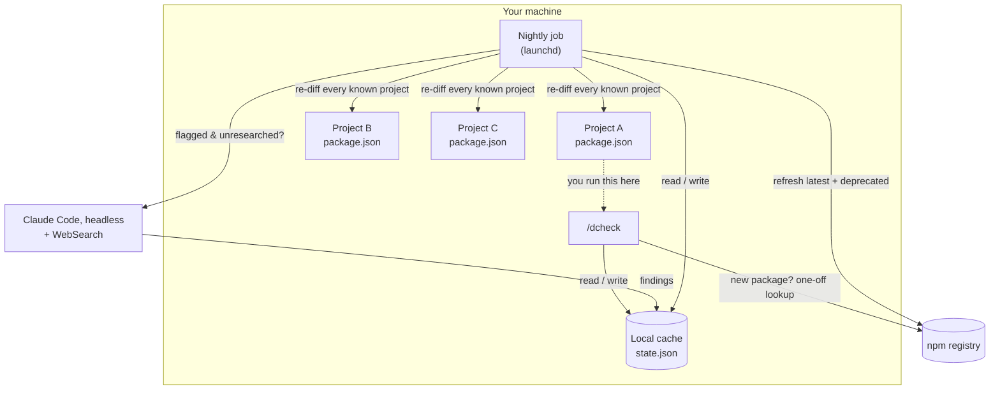
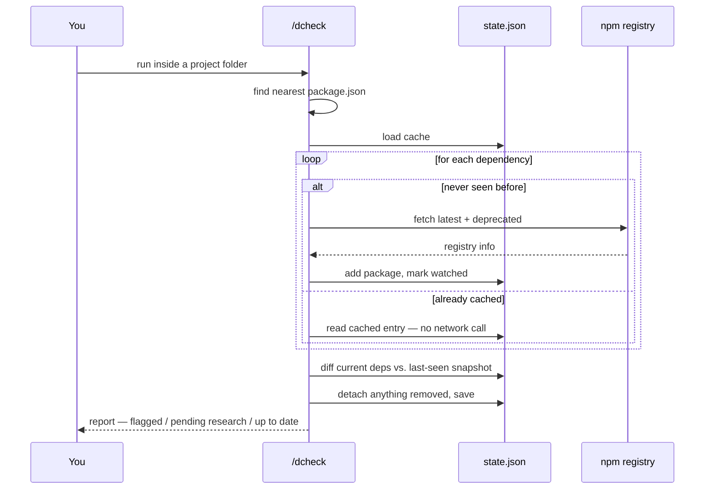
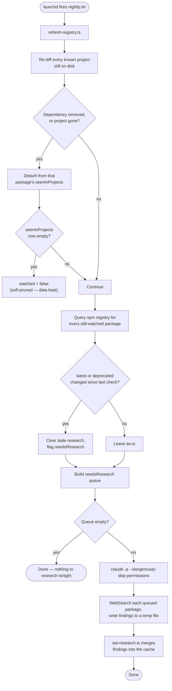
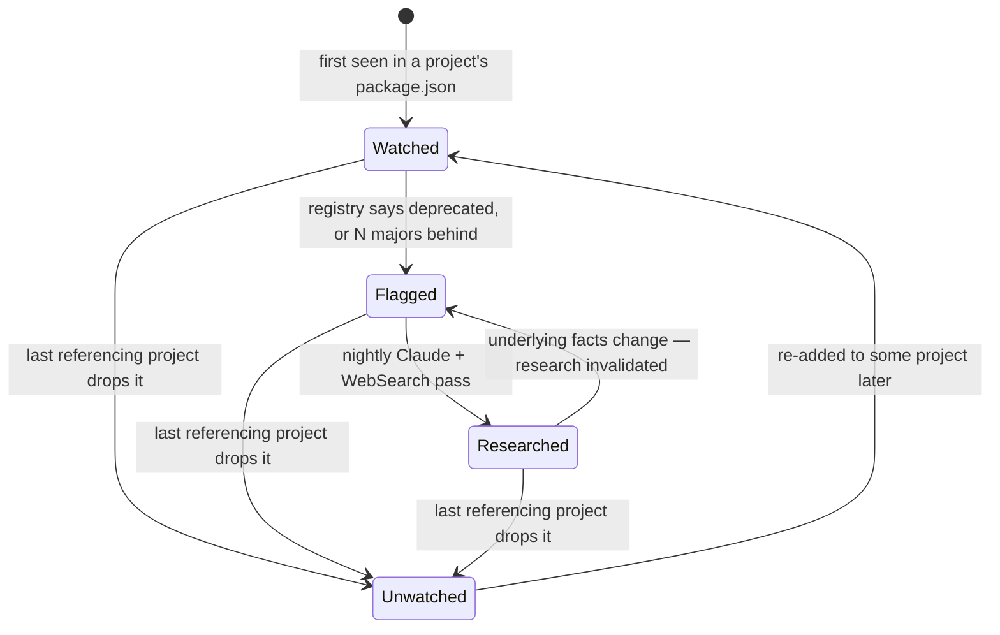
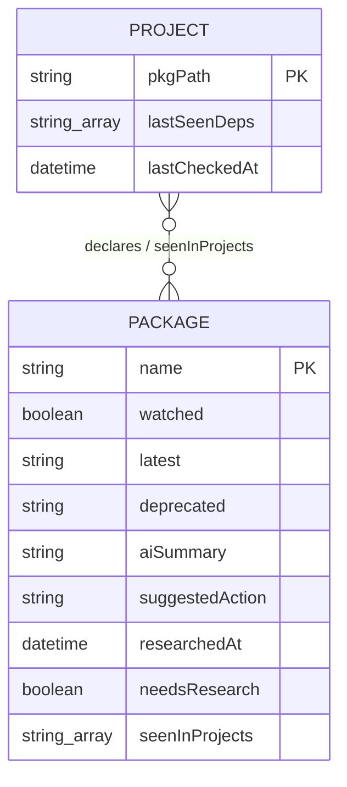

# DepsCheck

A local, offline-first dependency-health checker for npm projects. Point it
at any project and it tells you what's deprecated, what's aging, and — once
it's had a chance to look — what to actually do about it. No dashboard, no
SaaS, no CI required: it's a slash command plus a background job on your own
machine.

```
you@laptop some-project % /dcheck

Needs attention now
  lucide-react (^0.475.0 → 1.27.0, 1 major behind)
    Not deprecated, actively maintained. v1 is a full rewrite of the icon
    set with a smaller bundle and a new import style — not a drop-in bump,
    check the migration guide before touching this.
    → Suggested: read the v1 migration guide first, budget real time for it.

Flagged, research pending (ready after tonight's refresh)
  @types/node, tailwindcss, typescript

Up to date: 16 packages
```

## Table of contents

- [Why this exists](#why-this-exists)
- [How it works](#how-it-works)
  - [Architecture at a glance](#architecture-at-a-glance)
  - [Running a check](#running-a-check-dcheck)
  - [The nightly job](#the-nightly-job)
  - [Package lifecycle](#package-lifecycle)
  - [The cache, concretely](#the-cache-concretely)
- [Installation](#installation)
- [Usage](#usage)
- [Configuration](#configuration)
- [Design decisions worth knowing about](#design-decisions-worth-knowing-about)
- [Limitations](#limitations)
- [Roadmap ideas](#roadmap-ideas)
- [Contributing](#contributing)
- [License](#license)

## Why this exists

Renovate and Dependabot already tell you *that* a dependency is out of date
and will happily open a PR to bump it. What they don't do is tell you
*whether you should care* — is this package actually abandoned, is the new
major a two-line bump or a rewrite, is there a better-maintained replacement
entirely. That's a research task, and until recently that meant a human
opening five tabs.

DepsCheck hands that research step to an LLM with web search, but scopes it
carefully:

- **You control what gets tracked.** Nothing is scanned in bulk on install.
  A package only enters the system the first time you run `/dcheck` inside a
  project that depends on it.
- **Checking is instant and offline.** Once a package has been researched,
  every future check reads a local cache — no network call, no AI call, no
  waiting.
- **Research happens once, in the background, on a schedule you control** —
  not synchronously while you're waiting on an answer, and not repeated for
  every project that happens to share a dependency.
- **It forgets what you stop using.** Migrate off a package and DepsCheck
  notices on its own within one nightly cycle, without you telling it to.

## How it works

### Architecture at a glance



Two independent paths share one cache: the interactive path (you, typing
`/dcheck`) only ever *reads* it and does small, cheap writes for genuinely
new packages. The nightly path is where the actual work — registry refresh,
pruning, AI research — happens, asynchronously, whether or not you're
sitting at your laptop.

### Running a check (`/dcheck`)



The only case that touches the network is a package DepsCheck has never
seen anywhere before, and even then it's a single unauthenticated GET to
the public npm registry — no AI involved yet. That's what keeps `/dcheck`
feeling instant for anything you've checked before.

### The nightly job



Registry refresh runs every night regardless — it's cheap (a batch of GETs,
no auth, no tokens). Claude only gets invoked at all if something is
actually new or newly flagged, so a quiet night costs nothing.

### Package lifecycle



"Unwatched" isn't deletion — the entry stays in the cache with its
last-known data, it just stops being nightly-checked. If you reintroduce
the package somewhere, it picks back up where it left off.

### The cache, concretely

`state.json` has two tables: packages (facts about a package, independent
of any one project) and projects (what each known `package.json` last
declared, used purely to detect additions/removals).



A real (trimmed) entry looks like this:

```json
{
  "packages": {
    "lucide-react": {
      "watched": true,
      "latest": "1.27.0",
      "deprecated": null,
      "lastCheckedRegistry": "2026-07-28T06:00:11.204Z",
      "aiSummary": "Not deprecated, actively maintained. v1 is a full rewrite of the icon set with a smaller bundle and a new import style.",
      "suggestedAction": "Not a drop-in bump — read the v1 migration guide before upgrading.",
      "researchedAt": "2026-07-28T06:01:47.812Z",
      "needsResearch": false,
      "seenInProjects": [
        "/Users/you/dev/some-project/package.json"
      ]
    }
  },
  "projects": {
    "/Users/you/dev/some-project/package.json": {
      "lastSeenDeps": ["react", "react-dom", "lucide-react", "..."],
      "lastCheckedAt": "2026-07-28T06:00:11.204Z"
    }
  }
}
```

## Installation

Requires a Node with native TypeScript support — stable without flags from
v23.6, available behind `--experimental-strip-types` from v22.6 (tested on
v26) — plus the [Claude Code CLI](https://github.com/anthropics/claude-code)
on your `PATH`. The scripts are plain `.ts` files with no build step: run
them directly (`node scripts/check-project.ts ...`), no `tsc`/`ts-node`
involved.

```bash
git clone <this-repo> DepsCheck
cd DepsCheck
./setup.sh
```

`setup.sh` fills in this clone's actual location wherever an absolute path
is needed (the slash command and the launchd plist both need one — see
[Limitations](#limitations) for why that can't be avoided entirely) and
installs the slash command to `~/.claude/commands/dcheck.md`. It writes the
launchd plist to `~/Library/LaunchAgents/` but does **not** load it — that's
a separate, explicit step:

```bash
launchctl load ~/Library/LaunchAgents/com.depscheck.nightly.plist
```

It's set to fire daily at 07:00 local time — edit the `Hour`/`Minute` keys
in `launchd/com.depscheck.nightly.plist` *before* running `setup.sh` (or
`launchctl unload`, edit the installed copy, `launchctl load` again later)
to change that.

To test the nightly job without waiting for morning:

```bash
bash scripts/nightly.sh
tail -f ~/.claude/depscheck/nightly.log
```

## Usage

```bash
# from inside any project with a package.json
/dcheck
```

That's the only interface. There's no separate "add project" step — the
first `/dcheck` you run in a project is what adds it.

Everything else is scriptable directly, if you want to drive it outside of
Claude Code:

```bash
node scripts/check-project.ts /path/to/some/project   # what /dcheck runs
node scripts/refresh-registry.ts                        # nightly step 1
node scripts/list-needs-research.ts                      # what's queued
```

## Configuration

There isn't much yet, deliberately:

| What | Where |
|---|---|
| Nightly run time | `Hour`/`Minute` in the launchd plist |
| Cache location | `scripts/lib/state.ts` (`STATE_DIR`) — defaults to `~/.claude/depscheck/` |
| What counts as "flagged" | `scripts/lib/registry.ts` (`extractMajor`) + the flag check in `check-project.ts` — currently: deprecated, or ≥1 major behind |
| Research prompt | `prompts/nightly-refresh.md` — edit this to change what Claude is asked to look for |

## Design decisions worth knowing about

- **Registry-only signals drive pruning, AI drives explanation.** Whether a
  package is *watched* at all is decided by deterministic facts (is it in
  some project's package.json). Whether it's *understood* is decided by an
  LLM. Keeping those separate means the expensive step never gates the
  cheap one.
- **The nightly job re-visits every known project itself**, rather than
  waiting for you to notice you migrated off something and re-run
  `/dcheck`. This is what makes the "it forgets what you stop using"
  property actually true instead of aspirational.
- **`majorsBehind` is a heuristic, not semver.** It regex-extracts the first
  number out of a version range and a latest version and subtracts. Good
  enough to flag "worth a look," not a replacement for `npm outdated`
  or a real semver library.
- **Research findings go stale on purpose.** If a package's `latest` or
  `deprecated` status changes after it's been researched, the cached
  research is discarded and re-queued rather than left to rot next to facts
  it no longer describes.

## Limitations

- **Two files need an absolute path baked in** (the slash command and the
  launchd plist) rather than resolving the install location dynamically at
  runtime — neither Claude Code's command format nor a launchd plist has a
  built-in way to say "wherever this repo happens to live." `setup.sh`
  papers over this at install time by templating both from `$(pwd)`, but if
  you move the cloned repo afterward you'll need to re-run it.
- **Only runs while your Mac is on.** `launchd`'s `StartCalendarInterval`
  doesn't wake a sleeping machine or catch up on missed runs. If that
  matters to you, swap it for a `RunAtLoad` check that also fires if the
  last successful run is >24h old.
- **No cross-machine sync.** The cache is local to one machine. Two laptops
  build two independent watchlists.
- **`majorsBehind` heuristic** (see above) can misfire on packages with
  unconventional versioning schemes.

## Roadmap ideas

- re-running `setup.sh` automatically detecting and fixing a moved-repo path
- an opt-in shared/synced cache for teams (would need to decide what to do
  about the fact that `seenInProjects` currently contains local filesystem
  paths, which aren't meaningful — or safe to share — across machines)
- a `--project` flag so `/dcheck` can target a path other than the cwd
- surfacing the *severity* of a change (patch-level security fix vs.
  ground-up rewrite) rather than just majors-behind count

## Contributing

Issues and PRs welcome. If you're proposing a behavior change to the
pruning/watchlist logic in `scripts/lib/project.ts`, please include a
before/after trace of `state.json` for the scenario you're fixing — that
logic is small but easy to get subtly wrong, and a concrete example is much
faster to review than a description.

## License

MIT
